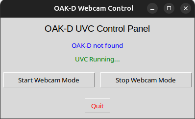
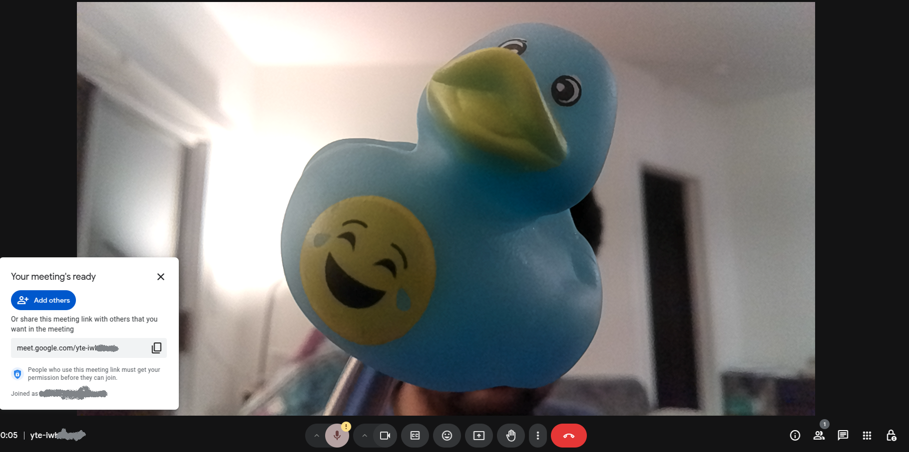

# OAK-D UVC Launcher

A sleek, one-click GUI app to turn your Luxonis OAK-D camera into a standard UVC webcam — perfect for use in Zoom, Google Meet, OBS, and more.

No more fumbling with scripts, udev rules, or systemd services. Just install, click, and stream.

## Features

- Simple start/stop interface
- Automatically detects OAK-D device
- Starts UVC mode using uvc_rgb.py
- Clean .deb installer — system integrated
- No terminal or coding required after install
- Works with all apps that support /dev/video*

## Screenshots

(Add screenshots in a folder named screenshots/ and reference them here)

| Launcher | Camera in Google Meet |
|----------|----------------|
|  |  |

## Installation

Download the latest .deb from the Releases page:

wget https://github.com/Pixeptron-Vision//oakd-uvc-launcher/releases/download/v1.0.0/oakd-uvc.deb
sudo dpkg -i oakd-uvc.deb
sudo apt --fix-broken install  # If needed

Once installed, launch from your app menu:
OAK-D Webcam GUI

## System Requirements

- Linux (Debian/Ubuntu)
- Python 3.8+
- depthai (installed in your virtualenv or system Python)
- Tkinter (sudo apt install python3-tk)

## How It Works

- GUI is built with Tkinter
- Script uses uvc_rgb.py from depthai-python
- Starts OAK-D as /dev/video*
- Works seamlessly with apps expecting a webcam

## Build It Yourself (Optional)

git clone https://github.com/YOUR_USERNAME/oakd-uvc-launcher.git
cd oakd-uvc-launcher
chmod +x build_deb.sh
./build_deb.sh

This will create a fresh oakd-uvc.deb in the root directory.

## Uninstall

sudo apt remove oakd-uvc

This will remove the app, launcher, and all system integration files.

## Troubleshooting

Device not found?
Make sure your OAK-D is connected and shows up in:

lsusb | grep 03e7:2485

No video in Zoom/Meet?
Run this and look for a Luxonis webcam device:

v4l2-ctl --list-devices

Still stuck? Open an issue on GitHub and I’ll help you out.

## Contributions

Pull requests are welcome! Want to add:
- System tray support?
- Auto-start at boot?
- OBS scene toggling?

Fork the repo and go wild!

## Author

Made with ❤️ by Sri Chakra  
Built to get the OAK-D camera work as a webcam.

## License

This project is licensed under the MIT License.
